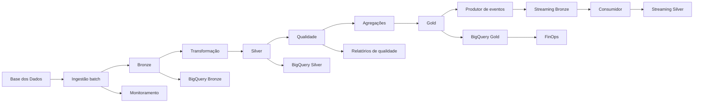

# Tech Challenge — Pipeline de Dados de Alfabetização

Pipeline de dados híbrida, com processamento batch e simulação de streaming, desenvolvida para analisar indicadores de alfabetização no Brasil.

O projeto utiliza dados públicos da Base dos Dados, arquitetura Medallion, validações de qualidade, Google BigQuery, observabilidade e práticas de FinOps.

## Objetivo

Construir uma solução de engenharia de dados capaz de:

- extrair dados educacionais públicos;
- preservar dados brutos;
- limpar e padronizar registros;
- validar a qualidade dos dados;
- gerar indicadores analíticos;
- comparar resultados com metas;
- analisar a evolução entre 2023 e 2024;
- simular o processamento de eventos em streaming;
- armazenar as camadas no Google BigQuery;
- monitorar a execução da pipeline;
- estimar custos e oportunidades de otimização.

## Fonte dos dados

Os dados são provenientes do projeto público:

```text
basedosdados.br_inep_avaliacao_alfabetizacao
```

Tabelas utilizadas:

- `alunos`;
- `uf`;
- `municipio`;
- `meta_alfabetizacao_brasil`;
- `meta_alfabetizacao_uf`;
- `meta_alfabetizacao_municipio`.

Os microdados de alunos utilizados contemplam os anos de 2023 e 2024.

## Arquitetura

A solução utiliza a arquitetura Medallion:

- **Bronze:** dados brutos provenientes da fonte;
- **Silver:** dados limpos, tipados, padronizados e validados;
- **Gold:** indicadores e agregações orientados à análise.

O fluxo possui componentes batch e streaming:



A documentação detalhada está disponível em:

```text
docs/arquitetura.md
```

## Tecnologias

- Python;
- Pandas;
- PyArrow;
- DuckDB;
- Google Cloud Platform;
- Google BigQuery;
- Base dos Dados;
- Parquet;
- JSONL;
- Git;
- Mermaid.

## Estrutura do projeto

```text
tech-challenge-fase-2/
├── config/
├── data/
│   ├── bronze/
│   ├── silver/
│   └── gold/
├── docs/
├── notebooks/
├── src/
│   ├── cloud/
│   ├── finops/
│   ├── ingestion/
│   ├── monitoring/
│   ├── quality/
│   ├── streaming/
│   └── transformation/
├── tests/
├── .gitignore
├── README.md
└── requirements.txt
```

Os arquivos de dados e logs de execução não são enviados ao repositório por causa do volume e por serem artefatos gerados pela pipeline.

## Configuração do ambiente

### 1. Clonar o repositório

```bash
git clone <URL_DO_REPOSITORIO>
cd tech-challenge-fase-2
```

### 2. Criar o ambiente virtual

No Windows:

```powershell
py -m venv .venv
```

### 3. Ativar o ambiente

```powershell
.\.venv\Scripts\Activate.ps1
```

### 4. Instalar as dependências

```powershell
py -m pip install -r requirements.txt
```

## Autenticação no Google Cloud

O projeto utiliza o Google Cloud com o seguinte identificador:

```text
tc-alfabetizacao-lucas
```

Realize a autenticação:

```powershell
gcloud auth login
```

Configure as credenciais locais da aplicação:

```powershell
gcloud auth application-default login --scopes="https://www.googleapis.com/auth/cloud-platform"
```

Defina o projeto:

```powershell
gcloud config set project tc-alfabetizacao-lucas
```

Os datasets foram configurados na região:

```text
US
```

## Execução da pipeline local

A execução deve seguir a ordem abaixo.

### 1. Ingestão das tabelas de referência

```powershell
py src/ingestion/ingestao_batch.py
```

### 2. Ingestão dos microdados de alunos

```powershell
py src/ingestion/ingestao_alunos.py
```

A ingestão dos alunos é realizada por ano e em blocos para reduzir o consumo de memória.

### 3. Transformação das tabelas de referência

```powershell
py src/transformation/transformacao_referencias.py
```

### 4. Transformação dos alunos

```powershell
py src/transformation/transformacao_alunos.py
```

### 5. Validação da camada Silver

```powershell
py src/quality/validacao_silver.py
```

### 6. Criação da camada Gold

```powershell
py src/transformation/criar_camada_gold.py
```

### 7. Validação da camada Gold

```powershell
py src/quality/validacao_gold.py
```

## Camada Bronze

A camada Bronze preserva os dados brutos com mínima transformação.

Diretório:

```text
data/bronze
```

Características:

- armazenamento em Parquet;
- organização por ano;
- registro da data de ingestão;
- preservação dos dados originais;
- suporte ao reprocessamento;
- eventos de streaming em JSONL.

## Camada Silver

A camada Silver contém os dados tratados.

Diretório:

```text
data/silver
```

Processamentos aplicados:

- normalização dos nomes das colunas;
- conversão de tipos;
- padronização de textos;
- tratamento de valores nulos;
- remoção de duplicidades;
- validação de domínios;
- inclusão de metadados.

## Camada Gold

A camada Gold contém tabelas prontas para análise.

Diretório:

```text
data/gold
```

Tabelas produzidas:

### Indicadores municipais

```text
indicador_alfabetizacao_municipio
```

Resultados de alfabetização agrupados por ano, estado, município e rede de ensino.

### Metas municipais

```text
metas_alfabetizacao_municipio
```

Metas definidas para os municípios e anos analisados.

### Comparação entre resultado e meta

```text
comparacao_meta_resultado_municipio
```

Apresenta:

- resultado observado;
- meta esperada;
- diferença entre resultado e meta;
- classificação do cumprimento da meta.

### Evolução temporal

```text
evolucao_alfabetizacao_municipio
```

Compara os indicadores de 2023 e 2024 e classifica a tendência como evolução, redução ou estabilidade.

## Streaming

O projeto possui uma simulação de processamento de eventos.

### Produtor de eventos

```powershell
py src/streaming/produtor_eventos.py --quantidade 10 --intervalo 0
```

O produtor seleciona dados da camada Gold e gera eventos JSONL.

### Consumidor de eventos

```powershell
py src/streaming/consumidor_eventos.py
```

O consumidor realiza:

- leitura dos eventos;
- validação do JSON;
- validação de campos obrigatórios;
- validação de tipos;
- validação de percentuais;
- controle de duplicidades;
- idempotência;
- gravação dos eventos válidos em Parquet.

Executar novamente o consumidor não duplica eventos já processados.

## Qualidade dos dados

As validações verificam:

- reconciliação entre camadas;
- duplicidades;
- campos obrigatórios;
- integridade das chaves;
- anos esperados;
- códigos de rede;
- percentuais válidos;
- consistência dos municípios;
- consistência entre resultados e metas;
- consistência da evolução temporal.

Relatórios gerados:

```text
docs/relatorio_qualidade_silver.csv
docs/relatorio_qualidade_gold.csv
```

Resultado da camada Gold:

```text
26 verificações
25 aprovadas
1 alerta
0 falhas
```

O alerta representa combinações de município e rede que não possuem resultados nos dois anos necessários para comparação temporal.

## Google BigQuery

Foram criados três datasets:

```text
tc_bronze
tc_silver
tc_gold
```

### Criar os datasets

```powershell
py src/cloud/criar_datasets_bigquery.py
```

### Carregar a camada Bronze

```powershell
py src/cloud/carregar_bronze_bigquery.py
```

### Carregar a camada Silver

```powershell
py src/cloud/carregar_silver_bigquery.py
```

### Carregar a camada Gold

```powershell
py src/cloud/carregar_gold_bigquery.py
```

Os scripts comparam a quantidade de registros locais com a quantidade carregada no BigQuery.

## Observabilidade

A pipeline possui execução monitorada por meio do script:

```text
src/monitoring/executar_pipeline_monitorada.py
```

Perfis disponíveis:

```text
qualidade
local
streaming
cloud-gold
completo
```

Exemplo de execução das validações:

```powershell
py src/monitoring/executar_pipeline_monitorada.py --perfil qualidade
```

A execução registra:

- identificador único;
- status geral;
- duração total;
- duração por etapa;
- quantidade de arquivos;
- quantidade de registros;
- tamanho das camadas;
- logs individuais;
- histórico em JSONL;
- resumo em CSV;
- alertas de falha.

Exemplo de resultado:

```text
Status: SUCESSO
Etapas executadas: 2
Etapas com sucesso: 2
Etapas com falha: 0
```

## FinOps

A análise de custos é executada por:

```powershell
py src/finops/estimar_custos_bigquery.py
```

O script analisa:

- quantidade de tabelas;
- registros armazenados;
- armazenamento lógico;
- histórico de consultas;
- bytes processados;
- bytes faturáveis;
- dry run de consultas;
- cenário mensal de dashboard;
- estimativa de custos;
- recomendações de otimização.

Resultados obtidos:

```text
Tabelas analisadas: 17
Registros armazenados: 7.885.085
Armazenamento lógico: 741,92 MiB
Consultas nos últimos 30 dias: 16
Dados faturáveis: 1,08 GiB
Cenário mensal de dashboard: 78,79 MiB
Custo estimado: US$ 0,00
```

Relatórios:

```text
docs/relatorio_finops_bigquery.csv
docs/relatorio_finops_bigquery.md
```

Os valores são estimativas técnicas e não representam uma fatura oficial.

## Práticas de otimização

Foram utilizadas as seguintes práticas:

- arquivos Parquet;
- armazenamento colunar;
- compressão;
- organização por ano;
- processamento em blocos;
- consultas prioritárias na camada Gold;
- dry run antes de consultas;
- redução do uso de `SELECT *`;
- controle dos bytes processados;
- possibilidade de particionamento e clusterização.

## Principais resultados

A solução processou aproximadamente:

```text
3.867.999 registros de alunos
```

As tabelas Gold permitem:

- acompanhar indicadores municipais;
- comparar resultados com metas;
- analisar diferenças por rede de ensino;
- identificar evolução entre 2023 e 2024;
- localizar municípios abaixo das metas;
- apoiar a construção de dashboards e relatórios.

## Limitações conhecidas

- o streaming utiliza arquivos JSONL em vez de um serviço de mensageria gerenciado;
- algumas combinações de município e rede não possuem dados nos dois anos;
- a tabela agregada de municípios não representa um cadastro municipal completo;
- os custos são estimativas baseadas nas premissas configuradas;
- a análise está limitada aos períodos disponibilizados pela fonte.

## Autor

**Lucas Lourenço**

Projeto desenvolvido para o Tech Challenge da pós-graduação em Ciência de Dados e Inteligência Artificial.