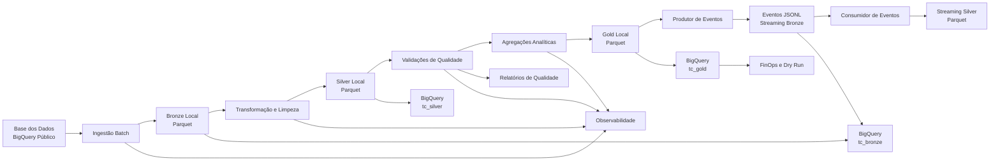

# Arquitetura da Solução

## 1. Visão geral

Este projeto implementa uma pipeline de dados híbrida para análise dos indicadores de alfabetização no Brasil.

A solução combina:

- processamento batch;
- simulação de processamento em streaming;
- arquitetura Medallion;
- validações de qualidade;
- armazenamento analítico no Google BigQuery;
- observabilidade;
- práticas de FinOps.

A arquitetura Medallion é dividida em:

- **Bronze:** dados brutos com mínima transformação;
- **Silver:** dados limpos, padronizados e validados;
- **Gold:** dados agregados e orientados à análise.

---

## 2. Diagrama da arquitetura



---

## 3. Fonte dos dados

Os dados são provenientes do projeto público da Base dos Dados:

```text
basedosdados.br_inep_avaliacao_alfabetizacao
```

As tabelas utilizadas são:

- `alunos`;
- `uf`;
- `municipio`;
- `meta_alfabetizacao_brasil`;
- `meta_alfabetizacao_uf`;
- `meta_alfabetizacao_municipio`.

Os microdados de alunos contemplam os anos de 2023 e 2024, totalizando:

```text
3.867.999 registros de alunos
```

---

## 4. Fluxo batch

O processamento batch é responsável por extrair os dados históricos da Base dos Dados e armazená-los localmente.

### 4.1 Ingestão das tabelas de referência

O script:

```text
src/ingestion/ingestao_batch.py
```

extrai as tabelas menores:

- unidades federativas;
- municípios;
- metas nacionais;
- metas estaduais;
- metas municipais.

Os dados são armazenados em arquivos Parquet na camada Bronze.

### 4.2 Ingestão dos microdados de alunos

O script:

```text
src/ingestion/ingestao_alunos.py
```

realiza a extração da tabela de alunos por ano e em blocos.

Essa estratégia evita carregar milhões de registros simultaneamente na memória.

Os arquivos são organizados no seguinte padrão:

```text
ano=<ano>/data_ingestao=<data>
```

Benefícios dessa organização:

- leitura seletiva;
- rastreabilidade;
- redução do consumo de memória;
- facilidade de reprocessamento;
- melhor organização dos dados.

---

## 5. Camada Bronze

A camada Bronze preserva os dados recebidos da fonte com mínima transformação.

Diretório local:

```text
data/bronze
```

Dataset no BigQuery:

```text
tc_bronze
```

Características:

- preservação dos valores originais;
- armazenamento batch em Parquet;
- armazenamento dos eventos em JSONL;
- registro da data de ingestão;
- separação dos microdados por ano;
- suporte ao reprocessamento da pipeline.

Os dados dessa camada não são utilizados diretamente em dashboards ou relatórios finais.

---

## 6. Camada Silver

A camada Silver contém os dados limpos, tipados e padronizados.

Diretório local:

```text
data/silver
```

Dataset no BigQuery:

```text
tc_silver
```

Scripts responsáveis:

```text
src/transformation/transformacao_referencias.py
src/transformation/transformacao_alunos.py
```

Transformações aplicadas:

- padronização dos nomes das colunas;
- conversão dos tipos de dados;
- normalização de textos;
- tratamento de valores nulos;
- remoção de duplicidades;
- validação dos anos;
- validação dos códigos de rede;
- inclusão de metadados de processamento.

A quantidade de registros é reconciliada com a camada Bronze para identificar perdas inesperadas durante a transformação.

---

## 7. Camada Gold

A camada Gold contém tabelas analíticas prontas para consultas, relatórios e dashboards.

Diretório local:

```text
data/gold
```

Dataset no BigQuery:

```text
tc_gold
```

O script responsável pela criação da camada é:

```text
src/transformation/criar_camada_gold.py
```

### 7.1 Indicadores de alfabetização por município

Tabela:

```text
indicador_alfabetizacao_municipio
```

Quantidade produzida:

```text
23.995 registros
```

Contém os resultados de alfabetização por:

- ano;
- unidade federativa;
- município;
- rede de ensino.

### 7.2 Metas municipais

Tabela:

```text
metas_alfabetizacao_municipio
```

Quantidade produzida:

```text
37.344 registros
```

Contém as metas de alfabetização definidas para os municípios e períodos analisados.

### 7.3 Comparação entre resultados e metas

Tabela:

```text
comparacao_meta_resultado_municipio
```

Quantidade produzida:

```text
5.232 registros
```

A comparação utiliza apenas combinações compatíveis entre indicadores e metas.

A tabela apresenta:

- resultado observado;
- meta esperada;
- diferença entre resultado e meta;
- classificação do cumprimento da meta.

### 7.4 Evolução temporal

Tabela:

```text
evolucao_alfabetizacao_municipio
```

Quantidade produzida:

```text
12.650 registros
```

Compara os resultados entre 2023 e 2024 e permite identificar:

- evolução;
- redução;
- estabilidade;
- ausência de um dos períodos necessários.

---

## 8. Processamento em streaming

O projeto possui uma simulação de streaming baseada em eventos JSONL.

Esse fluxo representa a chegada contínua de atualizações dos indicadores.

### 8.1 Produtor de eventos

O script:

```text
src/streaming/produtor_eventos.py
```

seleciona registros da camada Gold e os converte em eventos JSON.

Cada evento contém:

- identificador único;
- data e hora do evento;
- ano;
- código da unidade federativa;
- código do município;
- código da rede de ensino;
- taxa de alfabetização;
- variação observada.

Os eventos são armazenados inicialmente em:

```text
data/bronze/streaming
```

Exemplo de execução:

```powershell
py src/streaming/produtor_eventos.py --quantidade 10 --intervalo 0
```

### 8.2 Consumidor de eventos

O script:

```text
src/streaming/consumidor_eventos.py
```

realiza:

- leitura dos eventos JSONL;
- validação do formato JSON;
- verificação de campos obrigatórios;
- validação dos tipos;
- validação dos códigos de rede;
- validação dos percentuais;
- controle de duplicidades;
- idempotência;
- gravação dos eventos válidos em Parquet.

Exemplo de execução:

```powershell
py src/streaming/consumidor_eventos.py
```

A idempotência impede que um evento já processado seja gravado novamente.

---

## 9. Qualidade dos dados

A qualidade é verificada nas camadas Silver e Gold.

Scripts:

```text
src/quality/validacao_silver.py
src/quality/validacao_gold.py
```

As validações incluem:

- reconciliação entre Bronze e Silver;
- identificação de duplicidades;
- verificação de campos obrigatórios;
- integridade das chaves;
- validação dos anos esperados;
- validação dos códigos de rede;
- validação de percentuais;
- consistência dos municípios;
- consistência entre indicadores e metas;
- consistência da evolução temporal.

Relatórios gerados:

```text
docs/relatorio_qualidade_silver.csv
docs/relatorio_qualidade_gold.csv
```

Resultado das verificações da camada Gold:

```text
26 verificações
25 aprovadas
1 alerta
0 falhas
```

O alerta representa combinações de município e rede que não possuem resultados nos dois anos necessários para a análise temporal.

Algumas situações conhecidas da fonte são classificadas como alertas, e não como falhas críticas.

---

## 10. Infraestrutura em nuvem

A infraestrutura utiliza o Google Cloud Platform.

Projeto:

```text
tc-alfabetizacao-lucas
```

Localização dos datasets:

```text
US
```

Datasets criados:

```text
tc_bronze
tc_silver
tc_gold
```

Scripts utilizados:

```text
src/cloud/criar_datasets_bigquery.py
src/cloud/carregar_bronze_bigquery.py
src/cloud/carregar_silver_bigquery.py
src/cloud/carregar_gold_bigquery.py
```

Após cada carga, os scripts comparam:

- quantidade de registros locais;
- quantidade de registros armazenados no BigQuery;
- resultado da reconciliação.

Isso reduz o risco de cargas incompletas ou perda silenciosa de registros.

---

## 11. Observabilidade

A execução monitorada da pipeline é realizada por:

```text
src/monitoring/executar_pipeline_monitorada.py
```

A solução registra:

- identificador da execução;
- perfil executado;
- horário de início;
- horário de término;
- duração total;
- duração de cada etapa;
- status de sucesso ou falha;
- quantidade de arquivos;
- quantidade de registros;
- volume armazenado;
- logs individuais por etapa;
- resumo em CSV;
- histórico em JSONL;
- alertas de falha.

Perfis disponíveis:

```text
qualidade
local
streaming
cloud-gold
completo
```

Exemplo:

```powershell
py src/monitoring/executar_pipeline_monitorada.py --perfil qualidade
```

Resultado obtido no teste:

```text
Status: SUCESSO
Etapas executadas: 2
Etapas com sucesso: 2
Etapas com falha: 0
```

Os logs são mantidos localmente e não são versionados pelo Git.

---

## 12. FinOps

O controle de custos e consumo do BigQuery é realizado por:

```text
src/finops/estimar_custos_bigquery.py
```

A análise contempla:

- número de datasets;
- número de tabelas;
- quantidade de registros;
- armazenamento lógico;
- histórico de consultas;
- bytes processados;
- bytes faturáveis;
- dry run de consultas analíticas;
- projeção mensal para um dashboard;
- estimativa de custos;
- recomendações de otimização.

Relatórios gerados:

```text
docs/relatorio_finops_bigquery.csv
docs/relatorio_finops_bigquery.md
```

Resultados obtidos:

```text
Tabelas analisadas: 17
Registros armazenados: 7.885.085
Armazenamento lógico: 741,92 MiB
Consultas nos últimos 30 dias: 16
Dados faturáveis: 1,08 GiB
Cenário mensal de dashboard: 78,79 MiB
Custo estimado: US$ 0,00
```

Os valores representam estimativas técnicas baseadas nas premissas configuradas no script.

Práticas utilizadas para reduzir custos:

- uso de arquivos Parquet;
- compressão dos arquivos;
- processamento dos alunos em blocos;
- organização dos dados por ano;
- consultas preferenciais à camada Gold;
- uso de dry run;
- seleção apenas das colunas necessárias;
- controle dos bytes processados;
- avaliação de particionamento e clusterização.

---

## 13. Organização do projeto

```text
tech-challenge-fase-2/
├── config/
├── data/
│   ├── bronze/
│   ├── silver/
│   └── gold/
├── docs/
│   ├── arquitetura.md
│   ├── relatorio_finops_bigquery.csv
│   ├── relatorio_finops_bigquery.md
│   ├── relatorio_qualidade_gold.csv
│   ├── relatorio_qualidade_silver.csv
│   └── roteiro_apresentacao.md
├── notebooks/
├── src/
│   ├── cloud/
│   ├── finops/
│   ├── ingestion/
│   ├── monitoring/
│   ├── quality/
│   ├── streaming/
│   └── transformation/
├── tests/
├── .gitignore
├── README.md
└── requirements.txt
```

Os arquivos de dados e logs gerados durante as execuções não são enviados ao repositório.

---

## 14. Fluxo completo da pipeline

1. Extração dos dados da Base dos Dados;
2. armazenamento dos dados brutos na Bronze;
3. transformação e padronização para a Silver;
4. validação de qualidade da Silver;
5. criação das agregações da Gold;
6. validação de qualidade da Gold;
7. geração de eventos simulados;
8. consumo e validação dos eventos;
9. carga das três camadas no BigQuery;
10. reconciliação das quantidades;
11. monitoramento das execuções;
12. análise de custos e recomendações de FinOps.

---

## 15. Decisões de arquitetura

### 15.1 Formato Parquet

O formato Parquet foi escolhido por oferecer:

- armazenamento colunar;
- compressão eficiente;
- leitura seletiva de colunas;
- redução do espaço ocupado;
- bom desempenho em análises.

### 15.2 DuckDB

O DuckDB é utilizado nas validações para executar consultas SQL diretamente sobre os arquivos Parquet.

Essa escolha evita a necessidade de instalar e administrar um servidor de banco de dados local.

### 15.3 BigQuery

O BigQuery é utilizado como camada analítica em nuvem e também facilita a integração com a fonte pública utilizada pelo projeto.

### 15.4 Arquitetura Medallion

A separação entre Bronze, Silver e Gold melhora:

- rastreabilidade;
- governança;
- qualidade;
- manutenção;
- reprocessamento;
- consumo analítico.

### 15.5 Processamento em blocos

A ingestão dos alunos é executada em blocos para limitar o uso de memória e permitir o processamento dos milhões de registros disponíveis.

### 15.6 Idempotência

O consumidor de eventos controla os identificadores já processados para impedir a duplicação de eventos em reexecuções.

---

## 16. Limitações conhecidas

- o streaming é simulado por arquivos JSONL;
- não foi utilizado um serviço gerenciado de mensageria;
- algumas combinações de município e rede não possuem dados nos dois anos;
- a tabela agregada de municípios não representa um cadastro completo de municípios;
- os custos são estimativas técnicas;
- os dados analisados estão limitados aos períodos disponibilizados pela fonte;
- os arquivos de dados locais não estão incluídos no GitHub devido ao volume.

---

## 17. Resultado da arquitetura

A arquitetura implementada permite:

- processar dados históricos em lote;
- simular a chegada contínua de eventos;
- preservar dados brutos;
- aplicar limpeza e padronização;
- executar verificações de qualidade;
- produzir tabelas analíticas;
- armazenar as camadas no BigQuery;
- monitorar execuções;
- estimar custos;
- apoiar a construção de dashboards e relatórios sobre alfabetização.